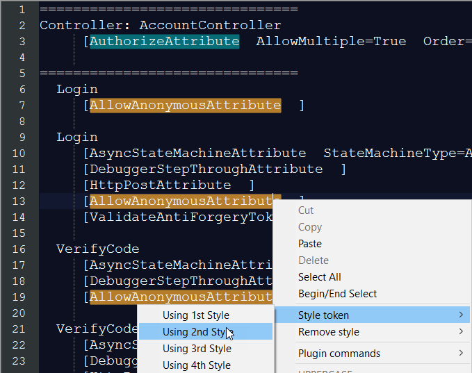

Title: How to Inspect and Audit ASP.NET MVC Declarative Role Based Authorization Attributes
Lead: A simple report that extracts an inventory of all controllers and declared attributes in an MVC site.

Date: 2/20/2017

Tags:

- MVC
- Security
- Reflection

---

When I work on relatively bigger public facing ASP.NET MVC applications, I have to make sure that all of the controllers (and actions within) are declared with a proper System.Web.Mvc.AuthorizeAttribute. With larger projects, this task can be tedious, and there is a chance of human error. Among many options to make this inspection task automated, an easy to implement idea is to extract a report that lists all of the Controllers in an MVC website and include all of the declared attributes for each controller. The data for the report can be extracted from the method Assembly.GetExecutingAssembly() like below:

```cs

var controllers = Assembly.GetExecutingAssembly()
	.GetExportedTypes()
	.Where(t => typeof(ControllerBase)
	.IsAssignableFrom(t));

```

The report can be extracted by adding a new `AuditController` controller to the MVC application _temporarily_ during the development. The source code is listed below. `AuditController` uses reflection to find all of the types inherited from `ControllerBase`.  Considering that `AuditController` is for development and testing only, it must be excluded from the production code deployment. That is why the `AuditController`’s implementation is surrounded by `#if DEBUG` preprocessor. That is to assure the code won’t be included in the release compile of the application.

<script src="https://gist.github.com/AliMoeen/a7bf58dd71450fe3e1b7ee4a7cda00e9.js"></script>

While the report output format can be extended to HTML or markdown this example produces pure text report to show the idea. Here is an example of what a text “MVC Controller Authorization” report output looks like this in Notepad++: 




Click [here](files/mvc-authorization-attributes-report-sample.txt "How to Inspect and Audit ASP.NET MVC Declarative Role Based Authorization Attributes") to see a sample report text file.  

## Please Note
Please note that the produced report simply renders all of the controllers’ attributes, not just the `Authorization` related attributes. Listing all attributes can broaden the report usage. It is easy to filter the attributes in the ListAttributes method.


# Ideas 

I came up with this idea back in 2008, a while ago. I have been using it since then. It provided a basic solution to the need. The approach can be enhanced with below ideas: 

+ **Better Reporting Format**: While it is not essential, the report output can use some cosmetic enhancements by producing HTML or Markdown. 
+ **Automated Tests**: It is possible to load the MVC application’s assemblies during the automated tests and make the process automated. The code listed here uses `Assembly.GetExecutingAssembly()` to generate the report at runtime.
+ **Roslyn**: See below

## Next Step: Roslyn Implementation

Al alternate (and potentially better) approach for extracting the same data and producing the same report is using Roslyn. I will provide a code example in my [next post](how-to-inspect-and-audit-mvc-authorization-attributes-using-roslyn "How to Inspect and Audit MVC Role Based Authorization Attributes Using Roslyn").

