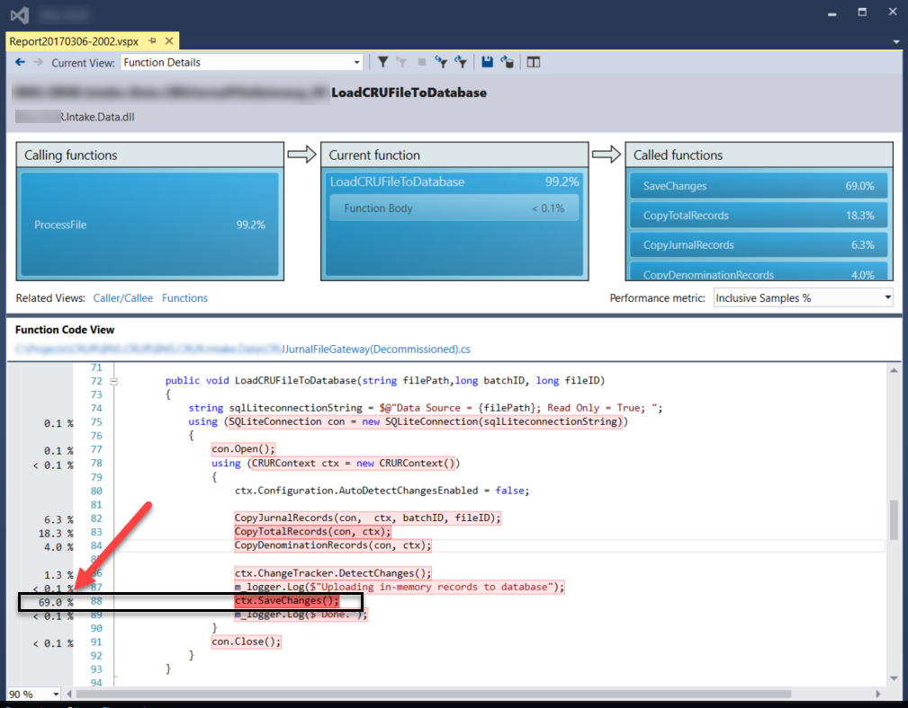

Title: How Not to Use Entity Framework for Bulk Insert
Lead: I Used Sqlbulkcopy as a Much More Efficient Alternative to Entity Framework for Bulk Upload

Date: 3/3/2017

Tags:

- Entity Framework
- SQL Server
- Data Access
---

Today, I needed to implement a bulk upload feature that uploads SQLite database files to SQL Server. Each SQLite file includes ~25,000 rows in multiple tables. 
A typical approach is to disable AutoDetectChangesEnabled, add the entities to the context, then detect the changes before DbContext.SaveChanges. Something like the following pseudo code:

```cs
DbContext.Configuration.AutoDetectChangesEnabled = false;
// Add many entities with DbSet.Add or DbSet.AddRange
DbContext.ChangeTracker.DetectChanges();
DbContext.SaveChanges();
```

As shown in the following Profiler Report below, the performance of the above approach was less than ideal. It took around seven (7) seconds to import a file. That would not be sufficient for the large number of files that I need to bulk upload daily. 



The problem is that Entity Framework inserts entities one-by-one. After inserts, it reads back the row into the DbSet. That is the right thing to do for ORM operations, but not ideal for bulk operations. 

## There Is No Built In Bulk Insert Option in Entity Framework

While there are 3rd party products available, as far as I know, there is no built-in ~~~bulk insert~~~ bulk add option in Entity Framework. So, I had to look somewhere else.

The solution I chose is [`System.Data.SqlClient.SqlBulkCopy`](https://msdn.microsoft.com/en-us/library/system.data.sqlclient.sqlbulkcopy(v=vs.110).aspx). It perfectly provides Bulk Insert (like what is available through BCP, SSIS or TSQL BULK INSERT) operations to .NET applications.

The SQL Profiler shows a trace of insert bulk statements like below:

```
insert bulk dbo.Total ([JournalEntryID] ... )
```

`insert bulk` is not a  TSQL statement. It is what SQL Profiler shows for Bulk Insert APIs like .NET `SqlBulkCopy` or BCP.

In my application, `SqlBulkCopy` performance improvement is outstanding. It takes ~100 ms to import a file. Compare to Entity Framework’s 7-second response. A **700%  improvement**!!!.

## Conclusion

When it comes to inserting a substantial number of records into a SQL Server database table, one of the [bulk import options](https://msdn.microsoft.com/en-us/library/ms187042.aspx) should be considered. TSQL `INSERT` statement would not be [performant](http://stackoverflow.com/questions/2112743/what-does-performant-software-actually-mean). 
There is no out of the box “Bulk” operation available in Entity Framework. EF might work fine with inserting smaller number of records, but its performance is suboptimal for bulk operations.

`System.Data.SqlClient.SqlBulkCopy` is an easy alternate option to implement Bulk Insert in .NET applications’ code. 

I think the .NET developer community would benefit from adding bulk options to Entity framework's `DbContext`. I [submitted the idea to .NET Framework User Voice](https://visualstudio.uservoice.com/forums/121579-visual-studio-ide/suggestions/18537679-implement-bulk-insert-in-entity-framework). If you think adding bulk options to 'DbContext' would help, please upvote.
